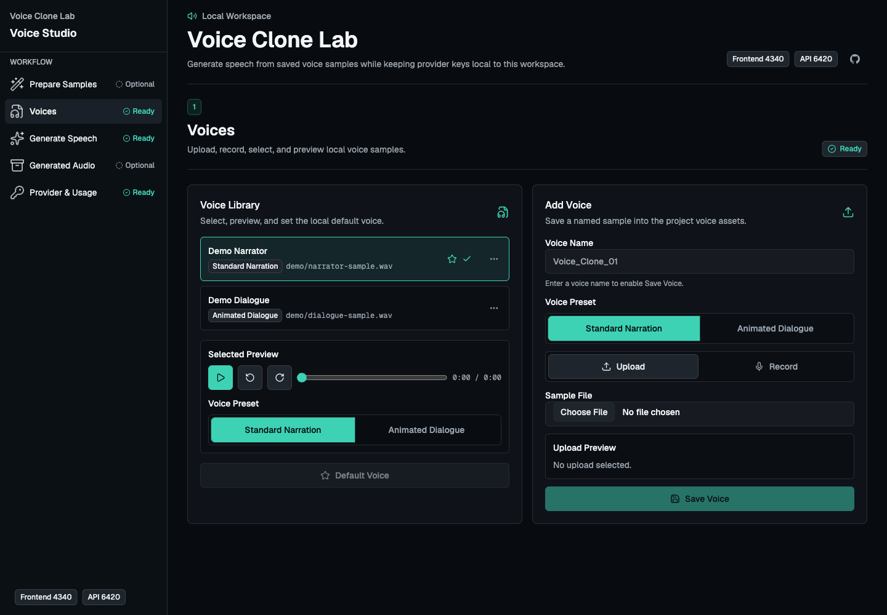

# Voice Clone Lab

Voice Clone Lab is a local-first voice studio for experimenting with provider-backed voice cloning from your own browser. It gives you a sidebar workflow for preparing samples, managing voices, generating speech, reviewing generated audio, and keeping provider keys plus usage controls in one local workspace.



Public-safe demo screenshot: this capture uses mocked data and does not include real API keys, voice samples, generated audio files, or account details. A mobile workflow navigation capture is available in [docs/assets/voice-studio-mobile.png](docs/assets/voice-studio-mobile.png).

## What This Is

- A local development tool for testing provider-backed voice cloning with built-in ElevenLabs support.
- A Docker Compose app with a React + TypeScript frontend and Python FastAPI backend.
- A browser workspace for saving named voice samples, choosing a voice, selecting a model, tuning generation settings, checking quota, navigating workflow sections, and downloading generated speech.

## What This Is Not

- Not a hosted service.
- Not a production authentication, billing, or user-management system.
- Not bundled with any voice sample or API key.
- Not a way to avoid provider usage, billing, consent, or content policies.

## Try It Locally

Clone the repository:

```sh
git clone https://github.com/Arty52/voice-cloning.git
cd voice-cloning
```

Create a local environment file:

```sh
cp .env.example .env
```

Optionally add an ElevenLabs key to `.env` as a backend fallback. You can also add a browser-local key from `Provider & Usage` instead.

```sh
ELEVENLABS_API_KEY=your_key_here
ELEVENLABS_MODEL_ID=eleven_multilingual_v2
```

Start the app:

```sh
make up
```

Open the Voice Studio:

```text
http://localhost:4340
```

The local API runs on:

```text
http://localhost:6420
```

## Public-Safe Defaults

- API keys stay local to `.env` or browser-local storage and are never returned by the API.
- Real voice samples under `assets/voices/` are ignored by git.
- Local voice preset assignments are saved with the ignored voice manifest under `assets/voices/`.
- Generated audio and provider cache data under `storage/` are ignored by git.
- Browser-generated audio is stored in browser IndexedDB by default, not committed to the repository.
- Speech job output, optional sample-processing output, separated stems, and downloaded model data are runtime-only and must stay out of git.
- The optional live smoke test calls ElevenLabs, may consume credits, and may create or reuse a cloned voice.

## Common Workflow

The Voice Studio opens on `Voices`. Use the sidebar to move between stable workflow sections:

1. `Prepare Audio` (`#prepare`, optional step 0): process uploaded or saved source audio before adding it to the library.
2. `Voices` (`#voices`, step 1): upload, record, select, preview, rename, and assign local voice presets.
3. `Generate Speech` (`#generate`, step 2): enter text, optionally assign selected text spans to saved voices, tune the request, choose model settings, generate speech, and review the latest result.
4. `Generated Audio` (`#archive`, optional): review, download, remove, or clear browser-saved generated audio.
5. `Provider & Usage` (`#provider`): add browser-local provider keys, confirm `.env` fallback, choose models, and review quota/cost metadata.

## Optional Sample Processing

The Docker backend includes FFmpeg because multi-voice speech jobs use it to assemble segment audio. Sample Processing is still disabled by default. To enable Trim Silence only, set:

```sh
INSTALL_SAMPLE_PROCESSING=1
SAMPLE_PROCESSING_ENGINE=ffmpeg
SAMPLE_PROCESSING_FFMPEG_COMMAND=ffmpeg
```

To enable Isolate Voice and Trim Silence together, install Demucs and FFmpeg in the backend runtime and set:

```sh
INSTALL_SAMPLE_PROCESSING=1
SAMPLE_PROCESSING_ENGINE=demucs
SAMPLE_PROCESSING_DEMUCS_MODEL=htdemucs
SAMPLE_PROCESSING_FFMPEG_COMMAND=ffmpeg
```

To enable Speaker Separation, install the diarization extra and FFmpeg, accept the Hugging Face model conditions for `pyannote/speaker-diarization-community-1`, and provide a Hugging Face token:

```sh
INSTALL_DIARIZATION=1
SAMPLE_PROCESSING_ENABLE_DIARIZATION=1
SAMPLE_PROCESSING_HF_TOKEN=hf_...
SAMPLE_PROCESSING_WHISPER_MODEL=medium
SAMPLE_PROCESSING_WHISPER_DEVICE=cpu
SAMPLE_PROCESSING_WHISPER_COMPUTE_TYPE=int8
PYANNOTE_METRICS_ENABLED=0
```

The Docker build uses CPU-only PyTorch, Torchaudio, and TorchCodec wheels when `INSTALL_SAMPLE_PROCESSING=1` or `INSTALL_DIARIZATION=1`, then installs the requested optional backend extras. Rebuild with `make recycle` after changing either flag. The backend calls FFmpeg as an external command, stores multi-voice speech job output under ignored `storage/speech-jobs/`, normalizes successful sample-processing results to mono 32 kHz WAV, and stores sample-processing job output under ignored `storage/sample-processing/`. Demucs, pyannote, and faster-whisper model files and caches are runtime data under ignored `storage/model-cache/`. Isolate Voice includes Fast, Balanced, Clean, and Max Isolation strength presets; Balanced preserves the default behavior. Trim Silence includes Light, Balanced, and Aggressive trim presets; Balanced is the default. Speaker Separation is V1 diarized speaker-turn extraction, not neural unmixing of simultaneous speakers.

## Documentation

- [Usage Guide](docs/USAGE.md): setup, key permissions, privacy model, cost notes, recording, and long-upload workflows.
- [API Reference](docs/API.md): local API routes, request fields, response headers, and provider metadata shapes.
- [Troubleshooting](docs/TROUBLESHOOTING.md): missing keys, scoped permissions, ports, quota errors, and cleanup.
- [Public Media Guidelines](docs/PUBLIC_MEDIA.md): public-safe screenshot and documentation media rules.
- [Architecture Standards](docs/ARCHITECTURE.md): backend/frontend boundaries for implementation work.
- [How To Add A Provider](docs/ADDING_PROVIDER.md): provider adapter responsibilities and validation.

## Local Development

Install host dependencies:

```sh
make setup
```

Run all checks:

```sh
make check
```

Useful Docker commands:

```sh
make logs
make down
make recycle
make destroy
```

Run an optional live smoke test after the Docker stack is running:

```sh
make smoke-live
```

## Project Structure

```text
.
├── assets/voices/        # local voice assets; real samples ignored by git
├── backend/              # FastAPI service and tests
├── docs/                 # architecture, usage, API, troubleshooting, and media docs
├── frontend/             # Vite React app and tests
├── scripts/              # local smoke helpers
├── storage/              # runtime cache/output; ignored by git
├── docker-compose.yml
└── Makefile
```

## License

MIT
